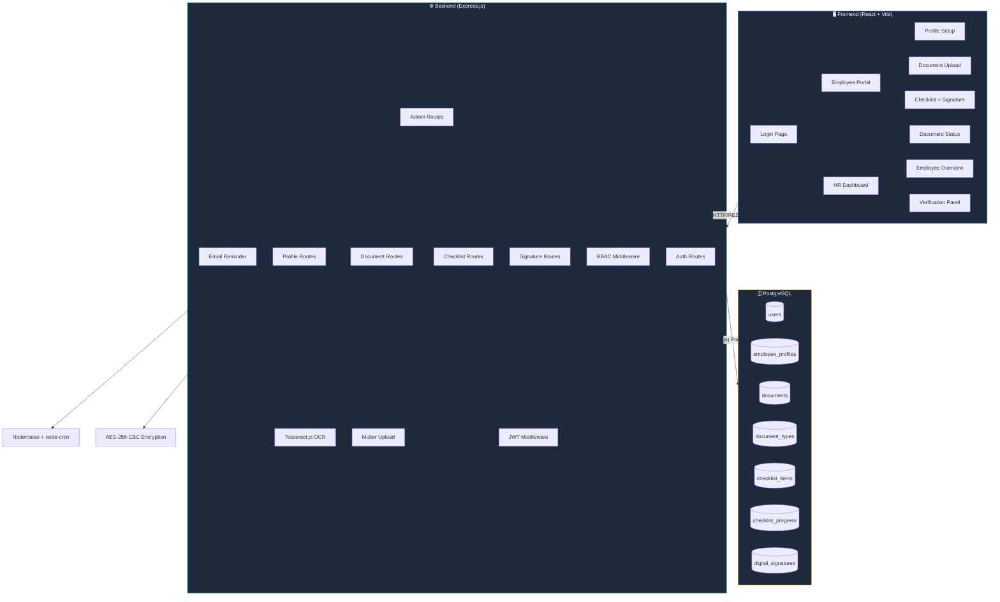
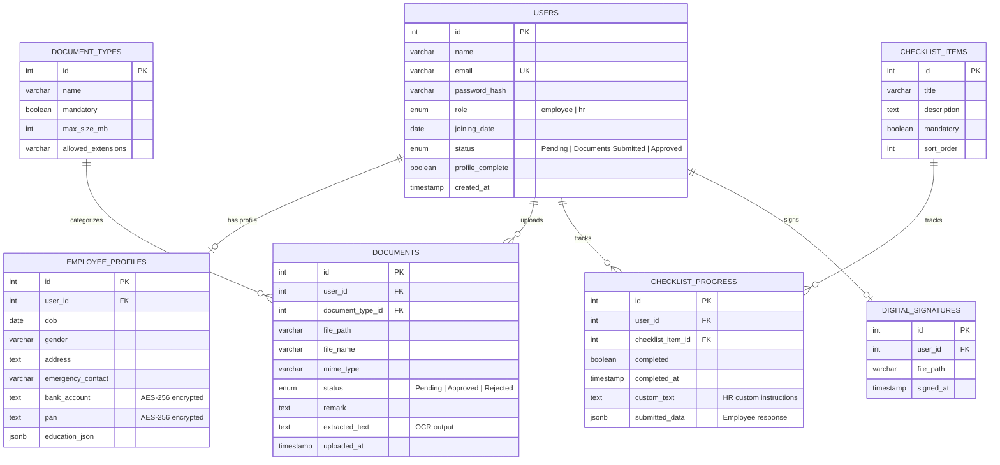

<p align="center">
  
</p>

<p align="center">
  
</p>

<p align="center">
  
  
  
  
  
  
  
</p>

---

## 📋 Table of Contents

- [✨ Features](#-features)
- [🏗️ Architecture](#️-architecture)
- [📂 Project Structure](#-project-structure)
- [⚡ Quick Start](#-quick-start)
- [🔧 Environment Variables](#-environment-variables)
- [🗄️ Database Setup](#️-database-setup)
- [🔌 API Reference](#-api-reference)
- [🖥️ Frontend Pages & Components](#️-frontend-pages--components)
- [🛠️ Utility Scripts](#️-utility-scripts)
- [🔐 Security](#-security)
- [📧 Email System](#-email-system)
- [🤝 Default Credentials](#-default-credentials)

---

## ✨ Features

<table>
<tr>
<td width="50%">

### 👤 Employee Portal
- 🔑 **First-time Password Setup** via email invite
- 📝 **Profile Builder** — DOB, gender, address, education, bank details
- 📄 **Document Upload** — Aadhar, PAN, Address Proof, Degree, Experience Letter
- 📋 **Interactive Checklist** — NDA signing, IT setup, handbook, bank details, ID photo
- ✍️ **Native Digital Signature** — HTML5 Canvas-based signing pad
- 📊 **Real-time Progress Tracking** — Auto-calculated from docs + checklist
- 📅 **Joining Date Confirmation** — Only unlocks when everything is complete

</td>
<td width="50%">

### 🛡️ HR Dashboard
- 📊 **Overview Panel** — All employees with live progress bars
- ➕ **Create New Employees** — Instant account provisioning
- ✅ **Document Verification** — Approve / Reject with remarks
- 🔍 **OCR Text Extraction** — Automatic text extraction from Aadhar, PAN images using Tesseract.js
- 👁️ **Document Preview** — In-browser PDF/Image viewer
- ✏️ **Customizable Checklist Forms** — Write custom instructions per employee per item
- 📨 **Email Reminders** — Manual + automated cron-based reminders with smart pending-item detection
- 🖊️ **View Digital Signatures** — See employee's signed NDA signature
- 📋 **View Employee Responses** — See submitted form data from checklist items

</td>
</tr>
</table>

---

## 🏗️ Architecture



---

## 📂 Project Structure

```
onboarding-portal/
├── 📁 backend/
│   ├── 📁 config/
│   │   └── db.js                  # PostgreSQL connection pool
│   ├── 📁 middleware/
│   │   ├── auth.js                # JWT token verification
│   │   └── rbac.js                # Role-based access (HR-only guard)
│   ├── 📁 routes/
│   │   ├── auth.routes.js         # POST /login, POST /setup
│   │   ├── profile.routes.js      # GET & PUT /profile
│   │   ├── document.routes.js     # Upload, OCR, signature, file serving
│   │   ├── checklist.routes.js    # GET & PATCH /checklist
│   │   ├── signature.routes.js    # POST & GET /signature
│   │   ├── joining.routes.js      # POST /joining/confirm
│   │   └── admin.routes.js        # HR: overview, verify, create, customize, remind
│   ├── 📁 utils/
│   │   ├── emailReminder.js       # Cron scheduler + Nodemailer templates
│   │   ├── encrypt.js             # AES-256-CBC encrypt/decrypt for PAN & bank
│   │   └── progress.js            # Progress % calculator (docs + checklist)
│   ├── 📁 uploads/                # Stored documents & signature PNGs
│   ├── schema.sql                 # Full database DDL + seed data
│   ├── server.js                  # Express app entry point
│   ├── run_schema.js              # One-time schema runner
│   ├── seed_employee.js           # Insert a demo employee
│   ├── update_hash.js             # Reset HR password hash
│   ├── deleteUser.js              # Delete a user + all cascade data
│   ├── eng.traineddata            # Tesseract English training data
│   └── .env                       # Environment variables (DO NOT COMMIT)
│
├── 📁 frontend/
│   ├── 📁 src/
│   │   ├── 📁 api/
│   │   │   └── axios.js           # Axios instance with JWT interceptor
│   │   ├── 📁 components/
│   │   │   ├── Navbar.jsx         # Top navigation bar (role-aware)
│   │   │   ├── DigitalSignature.jsx  # Legacy signature component
│   │   │   ├── ProgressBar.jsx    # Reusable progress bar
│   │   │   └── StatusBadge.jsx    # Status pill (Pending/Approved/Rejected)
│   │   ├── 📁 pages/
│   │   │   ├── Login.jsx          # Login + first-time setup
│   │   │   ├── ProfileSetup.jsx   # Employee profile form
│   │   │   ├── DocumentUpload.jsx # Document upload with OCR
│   │   │   ├── DocumentStatus.jsx # View uploaded documents & statuses
│   │   │   ├── Checklist.jsx      # Interactive checklist + NDA signature
│   │   │   └── 📁 hr/
│   │   │       ├── HRDashboard.jsx   # Employee overview table
│   │   │       └── HRVerify.jsx      # Document verification + checklist editor
│   │   ├── App.jsx                # React Router + ProtectedRoute
│   │   ├── App.css                # Global styles & design tokens
│   │   ├── index.css              # Tailwind imports
│   │   └── main.jsx               # ReactDOM entry
│   ├── index.html                 # Vite HTML entry
│   ├── vite.config.js             # Vite + React plugin config
│   └── package.json
│
└── README.md                      # You are here! 📍
```

---

## ⚡ Quick Start

### Prerequisites

| Tool | Version | Download |
|------|---------|----------|
| **Node.js** | >= 18.x | [nodejs.org](https://nodejs.org/) |
| **PostgreSQL** | >= 14.x | [postgresql.org](https://www.postgresql.org/download/) |
| **Git** | any | [git-scm.com](https://git-scm.com/) |

### 1️⃣ Clone the Repository

```bash
git clone https://github.com/your-username/onboarding-portal.git
cd onboarding-portal
```

### 2️⃣ Install Dependencies

```bash
# Backend
cd backend
npm install

# Frontend
cd ../frontend
npm install
```

### 3️⃣ Create the PostgreSQL Database

Open **pgAdmin** or a terminal with `psql`:

```sql
CREATE DATABASE onboarding_db;
```

### 4️⃣ Configure Environment Variables

Create a `.env` file inside the `backend/` folder. See the [Environment Variables](#-environment-variables) section below for the full reference.

### 5️⃣ Run the Database Schema

```bash
cd backend
node run_schema.js
```

This creates all tables, ENUM types, seeds the default document types, checklist items, and the default HR admin account.

### 6️⃣ (Optional) Reset HR Password

If the seeded HR password hash doesn't work, run:

```bash
node update_hash.js
```

This sets the HR password to `Admin@123`.

### 7️⃣ Start the Application

Open **two terminals**:

```bash
# Terminal 1 — Backend
cd backend
node server.js

# Terminal 2 — Frontend
cd frontend
npm run dev
```

### 8️⃣ Open in Browser

```
http://localhost:5173
```

> 🎉 You're live! Login as HR with `hr@company.com` / `Admin@123`

---

## 🔧 Environment Variables

Create a file at `backend/.env` with the following keys:

```env
# ─── Server ───────────────────────────────────────
PORT=5000

# ─── PostgreSQL Database ─────────────────────────
DB_HOST=localhost
DB_USER=postgres
DB_PASSWORD=your_postgres_password
DB_NAME=onboarding_db
DB_PORT=5432

# ─── Authentication ──────────────────────────────
JWT_SECRET=your_super_secret_jwt_key_here

# ─── Encryption (must be exactly 32 characters) ──
ENCRYPTION_KEY=12345678901234567890123456789012

# ─── Frontend URL (for email links) ──────────────
FRONTEND_URL=http://localhost:5173

# ─── Email (Gmail SMTP) ──────────────────────────
# To use Gmail, enable 2FA and create an App Password:
# https://myaccount.google.com/apppasswords
EMAIL_SERVICE=gmail
EMAIL_USER=your_email@gmail.com
EMAIL_PASSWORD=your_gmail_app_password
EMAIL_FROM=Onboarding Team <your_email@gmail.com>

# ─── Cron Schedule (default: daily at 9 AM) ──────
REMINDER_CRON=0 9 * * *
```

> [!WARNING]
> **Never commit your `.env` file to Git.** It contains secrets like your database password, JWT key, and email credentials. The `.gitignore` already excludes it.

> [!TIP]
> If `EMAIL_USER` and `EMAIL_PASSWORD` are left empty, the email system runs in **Preview Mode** — it generates reminder content without sending actual emails. Perfect for local development.

---

## 🗄️ Database Setup

### Entity Relationship Diagram



### Seeded Data

The schema automatically inserts:

| Category | Items |
|----------|-------|
| **Document Types** | Aadhar Card ✅, PAN Card ✅, Address Proof ✅, Degree Certificate ✅, Experience Letter (optional) |
| **Checklist Items** | Sign NDA, Complete IT Setup Form, Read Employee Handbook, Submit Bank Details, ID Card Photo Upload |
| **Default HR User** | `hr@company.com` with password `Admin@123` |

### Running the Schema

```bash
cd backend

# First time — creates all tables
node run_schema.js

# If you need to reset the HR password
node update_hash.js
```

> [!IMPORTANT]
> The schema uses PostgreSQL ENUM types (`user_role`, `user_status`, `doc_status`). If you need to re-run the schema on an existing database, you'll need to drop these types first or use `DROP DATABASE onboarding_db; CREATE DATABASE onboarding_db;` to start fresh.

---

## 🔌 API Reference

All routes are prefixed with `/api`. Authentication is via `Authorization: Bearer <JWT>` header.

### 🔑 Auth (`/api/auth`)

| Method | Endpoint | Auth | Description |
|--------|----------|------|-------------|
| `POST` | `/login` | ❌ | Login with email & password. Returns JWT + role. |
| `POST` | `/setup` | ❌ | First-time password setup for new employees (password_hash = `not_set_yet`). |

### 👤 Profile (`/api/profile`)

| Method | Endpoint | Auth | Description |
|--------|----------|------|-------------|
| `GET` | `/` | ✅ Employee | Get own profile with decrypted PAN & bank account. |
| `PUT` | `/` | ✅ Employee | Upsert profile data. Auto-marks `profile_complete` if all required fields present. |

### 📄 Documents (`/api/documents`)

| Method | Endpoint | Auth | Description |
|--------|----------|------|-------------|
| `POST` | `/upload` | ✅ Employee | Upload a document (multipart). Validates MIME type (PDF/JPG/PNG), runs **OCR** on images, upserts into DB. |
| `GET` | `/my` | ✅ Employee | Get all document types with own upload status. |
| `POST` | `/signature` | ✅ Employee | Submit base64 PNG digital signature. Saves to disk + DB. |
| `GET` | `/signature/me` | ✅ Employee | Check if signature exists + timestamp. |
| `GET` | `/file/:id` | ✅ Employee/HR | Stream a document file (ownership or HR check). |

### ✅ Checklist (`/api/checklist`)

| Method | Endpoint | Auth | Description |
|--------|----------|------|-------------|
| `GET` | `/` | ✅ Employee | Get all checklist items with completion status + custom_text from HR. |
| `PATCH` | `/:id` | ✅ Employee | Mark item as complete. Optionally include `submitted_data` (JSON) with form response. |

### ✍️ Signature (`/api/signature`)

| Method | Endpoint | Auth | Description |
|--------|----------|------|-------------|
| `POST` | `/` | ✅ Employee | Save digital signature (base64 PNG). |
| `GET` | `/me` | ✅ Employee | Check signature status. |

### 📅 Joining (`/api/joining`)

| Method | Endpoint | Auth | Description |
|--------|----------|------|-------------|
| `POST` | `/confirm` | ✅ Employee | Confirm joining date. Validates: profile complete + all mandatory docs approved + all mandatory checklist items done. |

### 🛡️ Admin (`/api/admin`)

| Method | Endpoint | Auth | Description |
|--------|----------|------|-------------|
| `GET` | `/onboarding/overview` | ✅ HR | Get all employees with progress percentages. |
| `GET` | `/documents/:userId` | ✅ HR | Get all documents for an employee (includes OCR `extracted_text`). |
| `PATCH` | `/documents/:id/verify` | ✅ HR | Approve/Reject a document with remark. |
| `POST` | `/employee` | ✅ HR | Create a new employee account (password = `not_set_yet`). |
| `GET` | `/employee/:userId/profile` | ✅ HR | Get employee profile (decrypted sensitive fields). |
| `GET` | `/employee/:userId/checklist` | ✅ HR | Get employee's checklist with `custom_text` and `submitted_data`. |
| `PUT` | `/employee/:userId/checklist/:itemId/customize` | ✅ HR | Set/update custom form text for a specific checklist item. |
| `GET` | `/employee/:userId/signature` | ✅ HR | Stream employee's digital signature image. |
| `POST` | `/employees/:id/reminder` | ✅ HR | Send a manual reminder email (or preview if email not configured). |

---

## 🖥️ Frontend Pages & Components

### Pages

| Page | Route | Role | Description |
|------|-------|------|-------------|
| **Login** | `/` | Public | Email + password login. Detects first-time employees (`not_set_yet`) and prompts password setup. |
| **Profile Setup** | `/profile` | Employee | Multi-section form: personal info, education (JSONB), bank details (encrypted). Auto-saves `profile_complete` flag. |
| **Document Upload** | `/documents/upload` | Employee | Dropdown for document type → file picker → upload with MIME validation. Shows OCR result for images. |
| **Document Status** | `/documents/status` | Employee | Overview of all document types and their upload/approval status. |
| **Checklist** | `/checklist` | Employee | Interactive checklist with modal-based completion. NDA opens a canvas signature pad. Other items show HR's custom text (or default demo forms) + a text area for employee response. |
| **HR Dashboard** | `/hr/dashboard` | HR | Table of all employees with progress bars, status badges. "Create Employee" form. "Send Reminder" button per employee. |
| **HR Verify** | `/hr/verify/:userId` | HR | Full employee detail view: profile, checklist (with custom text editor + employee responses), documents (with OCR text), signature preview, approve/reject controls. |

### Components

| Component | Description |
|-----------|-------------|
| `Navbar.jsx` | Fixed top nav. Shows role-specific links. Glassmorphism style. |
| `ProgressBar.jsx` | Reusable animated progress bar with percentage. |
| `StatusBadge.jsx` | Color-coded status pills (green/yellow/red). |
| `DigitalSignature.jsx` | Legacy signature component (kept for reference; main signature is now native canvas in `Checklist.jsx`). |

---

## 🛠️ Utility Scripts

Run these from the `backend/` directory:

```bash
# Initialize all database tables + seed data
node run_schema.js

# Reset the HR admin password to Admin@123
node update_hash.js

# Insert a demo employee (Riya Sharma)
node seed_employee.js

# Delete a user and ALL their data (documents, checklist, profile, signature)
node deleteUser.js <email>
# Example: node deleteUser.js riya@company.com
```

---

## 🔐 Security

| Feature | Implementation |
|---------|---------------|
| **Authentication** | JWT tokens (8h expiry) via `jsonwebtoken` |
| **Password Hashing** | bcrypt with 10 salt rounds |
| **Role-Based Access** | Middleware guards: `auth.js` (JWT) + `rbac.js` (HR-only) |
| **Data Encryption** | AES-256-CBC for PAN and bank account numbers (`encrypt.js`) |
| **File Validation** | MIME-type detection via `file-type` library (not just extension checking) |
| **Upload Limits** | 5MB max file size via Multer |
| **CORS** | Enabled via `cors` middleware |
| **Frontend Route Guards** | `ProtectedRoute` component checks token + role before rendering |

---

## 📧 Email System

The portal includes a comprehensive email reminder system:

### How it Works

1. **Automated Cron Job** — Runs daily at 9 AM (configurable via `REMINDER_CRON`). Scans all non-approved employees and sends reminders listing their specific pending items.
2. **Manual Reminders** — HR can click "Send Reminder" from the dashboard for any individual employee.
3. **Smart Detection** — The system checks for:
   - Incomplete profile
   - Missing joining date
   - Pending mandatory checklist items
   - Missing or unapproved mandatory documents
4. **Preview Mode** — If `EMAIL_USER` / `EMAIL_PASSWORD` are not set, the system generates the email content without sending, so you can test locally.

### Gmail Setup

1. Enable **2-Factor Authentication** on your Google account
2. Go to [App Passwords](https://myaccount.google.com/apppasswords)
3. Generate a new app password for "Mail"
4. Use that 16-character password as `EMAIL_PASSWORD` in your `.env`

---

## 🤝 Default Credentials

| Role | Email | Password |
|------|-------|----------|
| **HR Admin** | `hr@company.com` | `Admin@123` |
| **New Employee** | *(created by HR)* | Set on first login |

> [!NOTE]
> When HR creates a new employee, the account is created with `password_hash = 'not_set_yet'`. The employee must use the "First-time Setup" flow on the login page to set their password.

---

## 📄 License

This project is for educational and demonstration purposes.

---

<p align="center">
  
</p>
