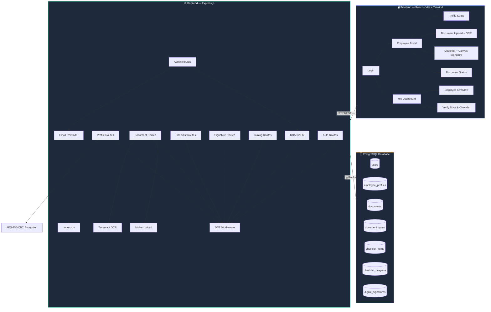
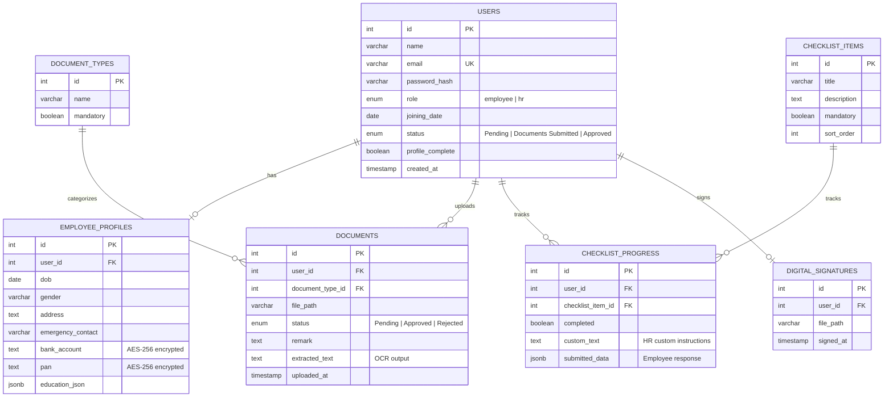

<p align="center">
  
</p>

<p align="center">
  
</p>

<p align="center">
  
  
  
  
  
  
  
  
</p>

<p align="center">
  <a href="https://onboarding-portal-qbnd.onrender.com" target="_blank">
    
  </a>
  <a href="https://onobarding-api-dtlb.onrender.com" target="_blank">
    
  </a>
  <a href="https://github.com/avinashmaharoliya/onobarding_platform" target="_blank">
    
  </a>
</p>

> 🔐 **Demo Login** — HR: `hr@company.com` / `Admin@123`

---

## 📋 Table of Contents

- [✨ Features](#-features)
- [🏗️ Architecture](#️-architecture)
- [📂 Project Structure](#-project-structure)
- [⚡ Quick Start — Local Development](#-quick-start--local-development)
- [🔧 Environment Variables (.env)](#-environment-variables-env)
- [🗄️ Database Setup](#️-database-setup)
- [🔌 API Reference](#-api-reference)
- [🖥️ Frontend Pages & Components](#️-frontend-pages--components)
- [🛠️ Utility Scripts](#️-utility-scripts)
- [🔐 Security](#-security)
- [📧 Email System](#-email-system)
- [☁️ Deploying to Render](#️-deploying-to-render)
- [🤝 Default Credentials](#-default-credentials)

---

## ✨ Features

<table>
<tr>
<td width="50%">

### 👤 Employee Portal
- 🔑 **First-time Password Setup** — HR creates account, employee sets own password on first login
- 📝 **Profile Builder** — Personal info, education (JSONB), emergency contact, bank details
- 📄 **Document Upload** — Aadhar, PAN, Address Proof, Degree, Experience Letter
- 🔍 **Auto OCR** — Text extracted automatically from uploaded images via Tesseract.js
- 📋 **Interactive Checklist** — 5 onboarding tasks with modal-based completion
- ✍️ **Digital Signature** — Draw on HTML5 Canvas, saved as PNG
- 📊 **Real-time Progress** — Auto-calculated from docs + checklist completion
- 📅 **Joining Confirmation** — Unlocks only when ALL steps are done

</td>
<td width="50%">

### 🛡️ HR Dashboard
- 📊 **Employee Overview** — All new hires with live progress bars
- ➕ **Create Employees** — Instant account provisioning by email
- ✅ **Document Verification** — Approve / Reject with remarks + view OCR text
- 📄 **In-browser Doc Preview** — PDF & image viewer
- ✏️ **Custom Checklist Forms** — Write personalized instructions per employee per task
- 📋 **View Employee Responses** — See submitted form data from every checklist item
- 👁️ **Signature Viewer** — View employee's drawn NDA signature
- 📨 **Email Reminders** — Manual trigger + automated daily cron with smart pending-item detection

</td>
</tr>
</table>

---

## 🏗️ Architecture



---

## 📂 Project Structure

```
onboarding-portal/
├── 📁 backend/
│   ├── 📁 config/
│   │   └── db.js                  # PostgreSQL connection pool (with SSL for cloud)
│   ├── 📁 middleware/
│   │   ├── auth.js                # JWT token verification
│   │   └── rbac.js                # Role-based access — HR-only guard
│   ├── 📁 routes/
│   │   ├── auth.routes.js         # POST /login, POST /setup
│   │   ├── profile.routes.js      # GET & PUT /profile (AES encrypt/decrypt)
│   │   ├── document.routes.js     # Upload, OCR, file serving, signature
│   │   ├── checklist.routes.js    # GET & PATCH /checklist
│   │   ├── signature.routes.js    # POST & GET /signature
│   │   ├── joining.routes.js      # POST /joining/confirm (full validation gate)
│   │   └── admin.routes.js        # HR: overview, verify, create, customize, remind
│   ├── 📁 utils/
│   │   ├── emailReminder.js       # Nodemailer + node-cron daily scheduler
│   │   ├── encrypt.js             # AES-256-CBC encrypt/decrypt for PAN & bank
│   │   └── progress.js            # Progress % calculator (docs + checklist)
│   ├── 📁 uploads/                # Stored files & signature PNGs (gitignored)
│   ├── schema.sql                 # Idempotent DDL — safe to run multiple times
│   ├── server.js                  # App entry point + Morgan logger + cron start
│   ├── setup.js                   # 🆕 First-time setup wizard (create DB + schema)
│   ├── reset.js                   # 🆕 Full DB drop + recreate (dev use only)
│   ├── run_schema.js              # Apply schema to existing DB
│   ├── update_hash.js             # Reset HR password hash
│   ├── seed_employee.js           # Insert a demo employee
│   ├── deleteUser.js              # Delete user + all cascade data
│   ├── eng.traineddata            # Tesseract English model (gitignored)
│   ├── package.json
│   └── .env                       # ⚠️ Never commit this
│
├── 📁 frontend/
│   ├── 📁 src/
│   │   ├── 📁 api/
│   │   │   └── axios.js           # Axios instance + JWT interceptor + env URL
│   │   ├── 📁 components/
│   │   │   ├── Navbar.jsx         # Glassmorphism top nav — role-aware links
│   │   │   ├── DigitalSignature.jsx
│   │   │   ├── ProgressBar.jsx    # Animated progress bar
│   │   │   └── StatusBadge.jsx    # Color-coded status pill
│   │   ├── 📁 pages/
│   │   │   ├── Login.jsx          # Login + first-time password setup
│   │   │   ├── ProfileSetup.jsx   # Multi-section profile form
│   │   │   ├── DocumentUpload.jsx # Upload with MIME validation + OCR result
│   │   │   ├── DocumentStatus.jsx # Document approval status overview
│   │   │   ├── Checklist.jsx      # Interactive checklist + NDA canvas signature
│   │   │   └── 📁 hr/
│   │   │       ├── HRDashboard.jsx   # Employee table + progress + create + remind
│   │   │       └── HRVerify.jsx      # Full employee detail + verify + customize
│   │   ├── App.jsx                # React Router + ProtectedRoute
│   │   └── main.jsx
│   ├── index.html
│   ├── vite.config.js
│   └── package.json
│
├── .gitignore
└── README.md
```

---

## ⚡ Quick Start — Local Development

### Prerequisites

| Tool | Version | Download |
|------|---------|----------|
| **Node.js** | ≥ 18.x | [nodejs.org](https://nodejs.org/) |
| **PostgreSQL** | ≥ 14.x | [postgresql.org](https://www.postgresql.org/download/) |
| **Git** | any | [git-scm.com](https://git-scm.com/) |

### 1️⃣ Clone

```bash
git clone https://github.com/avinashmaharoliya/onobarding_platform.git
cd onobarding_platform
```

### 2️⃣ Install Dependencies

```bash
# Backend
cd backend
npm install

# Frontend (open a new terminal)
cd frontend
npm install
```

### 3️⃣ Create your `.env` file

Inside the `backend/` folder, create a file called `.env`:

```env
PORT=5000
DB_HOST=localhost
DB_USER=postgres
DB_PASSWORD=your_postgres_password
DB_NAME=onboarding_db
DB_PORT=5432
JWT_SECRET=any_long_random_string_here
ENCRYPTION_KEY=12345678901234567890123456789012
FRONTEND_URL=http://localhost:5173
EMAIL_SERVICE=gmail
EMAIL_USER=
EMAIL_PASSWORD=
EMAIL_FROM=Onboarding Team <your@email.com>
REMINDER_CRON=0 9 * * *
```

> See the full [Environment Variables](#-environment-variables-env) section for details on every key.

### 4️⃣ Set Up the Database

**Option A — One command (recommended for first time):**
```bash
cd backend
npm run setup
```
This automatically:
- Creates the `onboarding_db` database if it doesn't exist
- Runs the full schema (all 7 tables + seed data)
- Prints the default HR login at the end

**Option B — Manual:**
```bash
# In psql or pgAdmin, create the database first:
CREATE DATABASE onboarding_db;

# Then apply the schema:
cd backend
node run_schema.js
```

### 5️⃣ Start the Servers

```bash
# Terminal 1 — Backend (runs on port 5000)
cd backend
npm run dev

# Terminal 2 — Frontend (runs on port 5173)
cd frontend
npm run dev
```

### 6️⃣ Open the App

```
http://localhost:5173
```

Login as HR: **`hr@company.com`** / **`Admin@123`**

---

## 🔧 Environment Variables (.env)

Create `backend/.env` with the following. All keys explained:

```env
# ── Server ─────────────────────────────────────────────────
PORT=5000
# The port Express listens on. Render overrides this automatically.

# ── PostgreSQL ──────────────────────────────────────────────
DB_HOST=localhost
# Use your cloud DB host when deploying (e.g. Render's host)

DB_USER=postgres
DB_PASSWORD=your_postgres_password
DB_NAME=onboarding_db
DB_PORT=5432
# SSL is auto-enabled when DB_HOST is not 'localhost'

# ── Authentication ──────────────────────────────────────────
JWT_SECRET=any_long_random_secret_string
# Used to sign & verify JWT tokens. Change this in production.
# Tokens expire after 8 hours.

# ── Encryption ──────────────────────────────────────────────
ENCRYPTION_KEY=12345678901234567890123456789012
# MUST be exactly 32 characters. Used for AES-256-CBC encryption
# of PAN numbers and bank account details.

# ── Frontend URL ────────────────────────────────────────────
FRONTEND_URL=http://localhost:5173
# Used in email reminder links. Set to your deployed frontend URL in production.

# ── Email (Gmail SMTP) ──────────────────────────────────────
EMAIL_SERVICE=gmail
EMAIL_USER=your_email@gmail.com
EMAIL_PASSWORD=your_gmail_app_password
# ⚠️ This must be a Gmail App Password, NOT your real Gmail password.
# Setup: Google Account → Security → 2FA → App Passwords → Generate
EMAIL_FROM=Onboarding Team <your_email@gmail.com>

# Leave EMAIL_USER and EMAIL_PASSWORD empty to run in Preview Mode
# (generates email content without sending — great for local dev)

# ── Cron Schedule ───────────────────────────────────────────
REMINDER_CRON=0 9 * * *
# When to auto-send reminder emails. Default: every day at 9:00 AM.
# Format: minute hour day month weekday
```

> [!WARNING]
> **Never commit your `.env` file.** It contains database passwords, JWT secret, and email credentials. It is already listed in `.gitignore`.

---

## 🗄️ Database Setup

### All Available Commands

```bash
cd backend

# First-time setup — creates DB + runs schema (RECOMMENDED)
npm run setup

# Apply schema to an existing database
npm run setup:schema

# Reset the HR admin password to Admin@123
node update_hash.js

# Insert a demo employee (Riya Sharma)
node seed_employee.js

# Delete a user + ALL their data
node deleteUser.js employee@email.com

# ⚠️ DANGER — Drop entire DB and start fresh (asks for confirmation)
npm run reset

# ⚠️ DANGER — Same but skips confirmation prompt
npm run reset:force
```

### Entity Relationship Diagram



### Seeded Data

The schema automatically seeds:

| Category | Items |
|----------|-------|
| **Document Types** | Aadhar Card ✅, PAN Card ✅, Address Proof ✅, Degree Certificate ✅, Experience Letter (optional) |
| **Checklist Items** | Sign NDA, Complete IT Setup Form, Read Employee Handbook, Submit Bank Details, ID Card Photo Upload |
| **Default HR User** | `hr@company.com` / `Admin@123` |

> [!NOTE]
> The schema is **idempotent** — safe to run multiple times. It uses `CREATE TABLE IF NOT EXISTS` and `ON CONFLICT DO NOTHING` so re-running never breaks existing data.

---

## 🔌 API Reference

All routes are prefixed with `/api`. Protected routes require `Authorization: Bearer <JWT>` header.

### 🔑 Auth — `/api/auth`

| Method | Endpoint | Auth | Description |
|--------|----------|:----:|-------------|
| `POST` | `/login` | ❌ | Login with email + password. Returns JWT + role. |
| `POST` | `/setup` | ❌ | First-time password setup for new employee accounts. |

### 👤 Profile — `/api/profile`

| Method | Endpoint | Auth | Description |
|--------|----------|:----:|-------------|
| `GET` | `/` | ✅ | Get own profile. PAN & bank account are decrypted before returning. |
| `PUT` | `/` | ✅ | Upsert profile. Auto-sets `profile_complete = true` when all fields present. |

### 📄 Documents — `/api/documents`

| Method | Endpoint | Auth | Description |
|--------|----------|:----:|-------------|
| `POST` | `/upload` | ✅ | Upload file (multipart). Validates MIME type, runs OCR on images, upserts record. |
| `GET` | `/my` | ✅ | Get all document types with own upload & approval status. |
| `GET` | `/file/:id` | ✅ | Stream the actual file. Ownership check — only own files or HR. |
| `POST` | `/signature` | ✅ | Submit base64 PNG signature. Saves to disk and DB. |
| `GET` | `/signature/me` | ✅ | Check if signature exists + timestamp. |

### ✅ Checklist — `/api/checklist`

| Method | Endpoint | Auth | Description |
|--------|----------|:----:|-------------|
| `GET` | `/` | ✅ | All checklist items with completion status + HR's custom text. |
| `PATCH` | `/:id` | ✅ | Mark item complete. Saves `submitted_data` (employee's form response). |

### ✍️ Signature — `/api/signature`

| Method | Endpoint | Auth | Description |
|--------|----------|:----:|-------------|
| `POST` | `/` | ✅ | Save digital signature (base64 PNG). |
| `GET` | `/me` | ✅ | Get signature status. |

### 📅 Joining — `/api/joining`

| Method | Endpoint | Auth | Description |
|--------|----------|:----:|-------------|
| `POST` | `/confirm` | ✅ | Confirm joining date. Guards: profile complete + all mandatory docs approved + all checklist done. |

### 🛡️ Admin (HR only) — `/api/admin`

All routes require both JWT auth AND HR role.

| Method | Endpoint | Description |
|--------|----------|-------------|
| `GET` | `/onboarding/overview` | All employees with live progress percentages. |
| `GET` | `/documents/:userId` | Employee's documents including OCR extracted text. |
| `PATCH` | `/documents/:id/verify` | Approve or Reject a document with optional remark. |
| `POST` | `/employee` | Create a new employee account (password = `not_set_yet`). |
| `GET` | `/employee/:userId/profile` | View employee's full profile (sensitive fields decrypted). |
| `GET` | `/employee/:userId/checklist` | View checklist with custom text + employee-submitted responses. |
| `PUT` | `/employee/:userId/checklist/:itemId/customize` | Set/update custom instructions for a checklist item. |
| `GET` | `/employee/:userId/signature` | Stream the employee's drawn signature image. |
| `POST` | `/employees/:id/reminder` | Send a manual email reminder (or preview if email not configured). |

---

## 🖥️ Frontend Pages & Components

### Pages

| Page | Route | Role | Description |
|------|-------|:----:|-------------|
| **Login** | `/` | Public | Email + password. Detects first-time employees and shows password setup flow. |
| **Profile Setup** | `/profile` | Employee | Personal info, emergency contact, education (JSONB), AES-encrypted bank & PAN. |
| **Document Upload** | `/documents/upload` | Employee | File picker → MIME validation → upload → shows OCR result for images. |
| **Document Status** | `/documents/status` | Employee | All document types with Pending / Approved / Rejected status badges. |
| **Checklist** | `/checklist` | Employee | Interactive modal checklist. NDA opens canvas signature pad. Others show HR custom text or demo forms. |
| **HR Dashboard** | `/hr/dashboard` | HR | Employee table with progress bars, status, create employee form, send reminder button. |
| **HR Verify** | `/hr/verify/:userId` | HR | Full detail view: verify docs, view OCR text, customize checklist forms, view employee responses, view signature. |

### Components

| Component | Description |
|-----------|-------------|
| `Navbar.jsx` | Fixed glassmorphism nav. Shows employee links (Profile, Documents, Checklist) or HR links (Dashboard) based on role. |
| `ProgressBar.jsx` | Animated progress bar used on HR dashboard. |
| `StatusBadge.jsx` | Color-coded pills: Pending (yellow), Approved (green), Rejected (red). |
| `DigitalSignature.jsx` | Signature component (native HTML5 canvas — no external library). |

---

## 🛠️ Utility Scripts

All run from the `backend/` directory.

```bash
# 🚀 First-time setup (creates DB + schema if they don't exist)
npm run setup

# 📋 Apply schema to an existing database
npm run setup:schema

# 🔑 Reset HR admin password to Admin@123
node update_hash.js

# 👤 Seed a demo employee (Riya Sharma / riya@company.com)
node seed_employee.js

# 🗑️ Delete a user and ALL their data (documents, checklist, profile, signature)
node deleteUser.js email@example.com

# ⚠️ FULL RESET — drops and recreates the entire database
npm run reset

# ⚠️ FULL RESET (no prompt, careful!)
npm run reset:force
```

---

## 🔐 Security

| Layer | Implementation |
|-------|---------------|
| **Authentication** | JWT tokens (8h expiry) signed with `jsonwebtoken` |
| **Password Storage** | bcrypt with 10 salt rounds — one-way, never reversible |
| **Role-Based Access** | `auth.js` verifies JWT → `rbac.js` checks HR role |
| **Data Encryption** | AES-256-CBC for PAN & bank account numbers |
| **File Validation** | `file-type` checks magic bytes, not just extension |
| **Upload Limits** | 5MB max per file via Multer |
| **SSL** | Auto-enabled for non-localhost database connections |
| **Frontend Guards** | `ProtectedRoute` checks token + role before rendering |

---

## 📧 Email System

### How it works

1. **Automated** — `node-cron` runs daily at 9 AM (configurable via `REMINDER_CRON`)
2. **Manual** — HR clicks "Send Reminder" button → triggers `sendManualReminder(userId)`
3. **Smart detection** — Only lists items that are actually pending for that specific employee:
   - ❌ Profile not complete
   - ❌ Joining date not confirmed
   - ❌ Mandatory checklist items not done
   - ❌ Mandatory documents not approved
4. **Preview Mode** — If `EMAIL_USER`/`EMAIL_PASSWORD` not set, returns email content without sending (perfect for local dev)

### Gmail Setup (for real emails)

1. Enable **2-Factor Authentication** on your Google account
2. Go to [myaccount.google.com/apppasswords](https://myaccount.google.com/apppasswords)
3. Generate an app password → select **Mail**
4. Use the 16-character code as `EMAIL_PASSWORD` in `.env`

---

## ☁️ Deploying to Render

### Step 1 — Create PostgreSQL Database
- Go to [render.com](https://render.com) → **New + → PostgreSQL**
- Name: `onboarding-db`, Region: closest to you, Plan: Free
- Copy the **External Database URL** for the next step

### Step 2 — Run Schema on Remote DB

Find your local psql path and run:
```bash
# Windows — find psql first
Get-ChildItem "C:\Program Files\PostgreSQL" -Recurse -Filter "psql.exe"

# Then run schema
& "C:\Program Files\PostgreSQL\18\bin\psql.exe" "YOUR_EXTERNAL_DATABASE_URL" -f backend/schema.sql
```

### Step 3 — Deploy Backend (Web Service)

| Field | Value |
|-------|-------|
| **Root Directory** | `backend` |
| **Build Command** | `npm install` |
| **Start Command** | `npm start` |

Add these **Environment Variables**:

| Key | Value |
|-----|-------|
| `PORT` | `5000` |
| `DB_HOST` | *(from Render DB credentials)* |
| `DB_USER` | *(from Render DB credentials)* |
| `DB_PASSWORD` | *(from Render DB credentials)* |
| `DB_NAME` | *(from Render DB credentials)* |
| `DB_PORT` | `5432` |
| `JWT_SECRET` | *(any long random string)* |
| `ENCRYPTION_KEY` | *(exactly 32 characters)* |
| `FRONTEND_URL` | *(add after Step 4)* |

### Step 4 — Deploy Frontend (Static Site)

| Field | Value |
|-------|-------|
| **Root Directory** | `frontend` |
| **Build Command** | `npm install; npm run build` |
| **Publish Directory** | `dist` |

Add this **Environment Variable**:

| Key | Value |
|-----|-------|
| `VITE_API_URL` | `https://your-backend-name.onrender.com/api` |

### Step 5 — Link Them
Go back to backend → Environment → set `FRONTEND_URL` to your frontend's Render URL.

> [!NOTE]
> Free Render services sleep after 15 min of inactivity. First request after sleep takes ~30 seconds. Normal for free tier — upgrade to Starter ($7/mo) for always-on.

### 🌐 Live Deployment URLs

| Service | URL |
|---------|-----|
| **Frontend** | https://onboarding-portal-qbnd.onrender.com |
| **Backend API** | https://onobarding-api-dtlb.onrender.com |
| **Database** | Render PostgreSQL — Singapore region |

---

## 🤝 Default Credentials

| Role | Email | Password | Notes |
|------|-------|----------|-------|
| **HR Admin** | `hr@company.com` | `Admin@123` | Seeded by `schema.sql` |
| **New Employee** | *(set by HR)* | *(set on first login)* | HR creates account → employee uses `/setup` |

> [!IMPORTANT]
> When HR creates a new employee, the account has `password_hash = 'not_set_yet'`. The employee must use the **"First-time Setup"** flow on the login page to set their own password before they can log in normally.

---

<p align="center">
  
</p>
